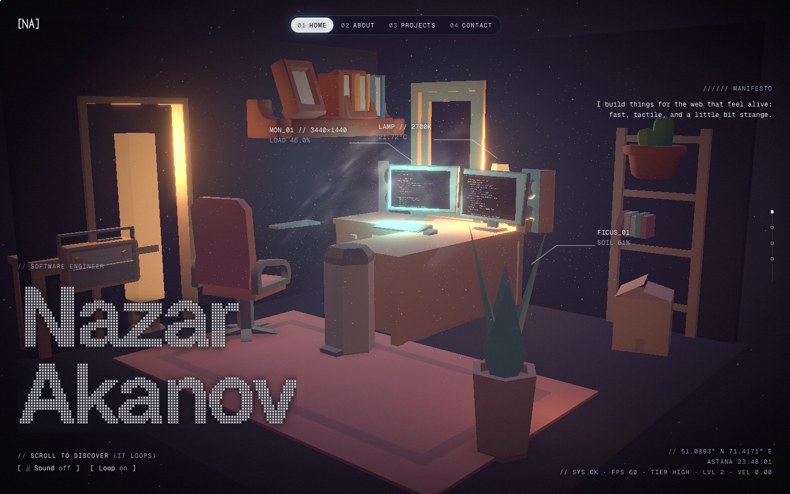
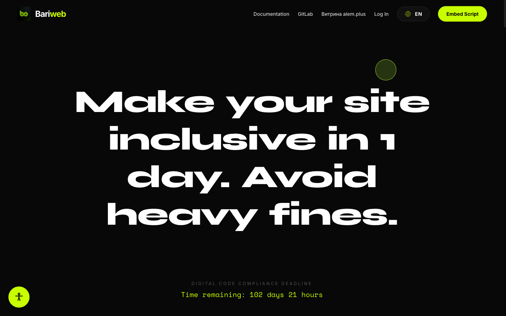
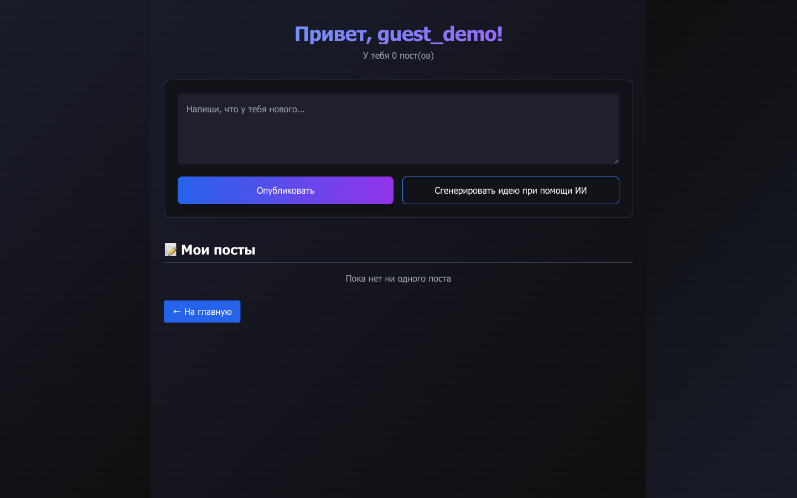

  

  

  
  
  
  
  

I'm Nazar, an AI & ML engineer from Kazakhstan, olympiad medalist, hackathon winner, and FLEX exchange alum. I build AI products end to end: the models and retrieval underneath, the backend that serves them, and the web and mobile apps people actually touch.

My flagship is **[Bariweb](https://github.com/Akanov-Kanta/bariweb)**, an AI agent that makes any website accessible with a single script tag. It reads the page, pulls context from a vector index of the whole site, and then clicks, navigates and fills in forms for the user from a typed or spoken request in Kazakh, Russian or English.

- **Building:** LLM agents that take real actions, RAG pipelines, voice interfaces
- **Going deeper into:** fine-tuning and evaluation, NLP, computer vision, MLOps
- **Shipping style:** from the model all the way to the CI/CD that deploys it

## Track record

| Achievement | Year |
|---|---|
| 🥉 **Bronze (Absolute 8)**, International AI Olympiad FAIO: 7 countries, 500 teams |2025 |
| 🥇 **Gold**, NIS AI Olympiad (2K+ students) | 2024 |
| 🥈 **Silver**, National Computer Science Olympiad | 2023 |
| 🥉 **Bronze ×2**, National AI Olympiad | 2023, 2024 |
| 🏆 **1st place**, Digitalization Day Hackathon (regional), $1K prize | |
| 🌎 **FLEX Finalist** (<1% acceptance rate), exchange year in Georgia, USA | 2024–2025 |

 

  
   
  <b><a href="https://portfolio-alpha-sandy-krad8msap8.vercel.app">Step into my room →</a></b> &nbsp;A scroll-driven 3D portfolio built with React Three Fiber. The camera flies through the scene on an endless loop.

## Featured work

  

### [Bariweb](https://github.com/Akanov-Kanta/bariweb): an AI accessibility agent for any website

One `<script>` tag gives a site an accessibility toolbar and an AI agent that operates the page for the user. A Playwright crawler maps every interactive element on a customer's site, enriches it with intents and multilingual keywords, and indexes it in **Milvus**. At request time the agent retrieves the right elements and replies with executable actions (click, navigate, type). It also takes voice commands, handles Kazakh, Russian and English through KazLLM / Alem models, generates `alt` and `aria-label` fixes, traces every run in **Langfuse**, and installs from npm as [`bariweb-widget`](https://www.npmjs.com/package/bariweb-widget).

**My part:** backend and AI agent, the embeddable widget SDK, and DevOps (GitLab → GitHub migration and Vercel CI/CD). 
`FastAPI` `LLM agents` `RAG` `Milvus` `RAGFlow` `Playwright` `PostgreSQL` `Lit` `Vercel` 
[**Live**](https://bariweb.vercel.app) · [**Code**](https://github.com/Akanov-Kanta/bariweb) · [**npm**](https://www.npmjs.com/package/bariweb-widget)

<table>
<tr>
<td width="50%" valign="top">

### [Bailanysta](https://github.com/Akanov-Kanta/Bailanysta)

A full-stack social network with a **GPT-4 writing assistant** built in. Users post, like and comment, and when they're stuck, one click drafts a post for them.

`Next.js 15` `React 19` `Supabase` `OpenAI` `Framer Motion`

</td>
<td width="50%" valign="top">

### [NIScourses](https://github.com/Akanov-Kanta/Courses)

A course-enrollment system for a whole school, with three roles, live seat counters and Excel export. Built by a team of three in 2023, **without any AI coding tools**.

`Flutter` `Firebase Auth` `Realtime Database`

</td>
</tr>
</table>

### More builds

- **[CodeHub](https://github.com/chillit/codeHub)**: a Flutter + Firebase learning platform for Python and C++ that has helped **200+ students across Kazakhstan** prepare for the national computer-science exam. Guided exercises with automatic error checking, hints based on the student's mistakes, roadmaps, progress tracking, and friend leaderboards. *(co-built, 2023–2025)*
- **NeSkuchnoPTR**: a hackathon PWA that collects every cultural, social and public event in Petropavl into one feed. It scrapes local Instagram and Telegram channels to stay current, recommends events with AI based on what each user likes, works offline, sends push notifications, and syncs to Google Calendar. *(Flutter, 2024)*

## Experience

**Software Developer Intern, ANTIKOR** · May–July 2023 
Built internal accounting tools and automated reporting workflows, with data validation that cut manual errors.

## Toolkit

**AI & ML**

 
Hugging Face · LangChain · OpenAI API · Ollama · Milvus · Langfuse · NumPy · pandas

**Full stack**

**MLOps & cloud**

 
MLflow · Weights & Biases · DVC · Apache Airflow

  

